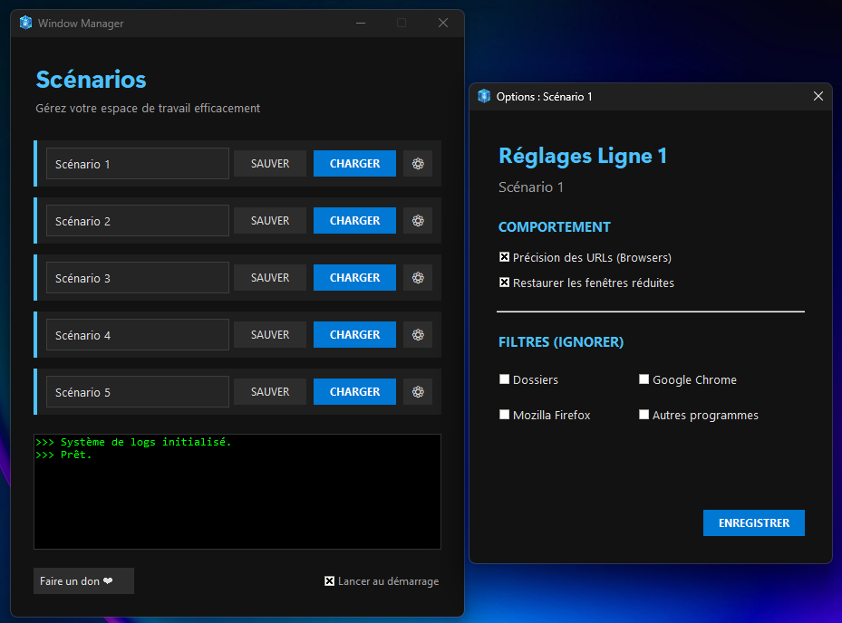

# Window Manager

**Window Manager** est un outil permettant de sauvegarder et restaurer efficacement la disposition de votre espace de travail sous Windows. Il mémorise la position, la taille et le contexte des fenêtres actives pour une restauration fidèle après un redémarrage.




## Fonctionnalités

*   **Restauration Complète** : Sauvegarde la géométrie et l'état (maximisé, minimisé) des fenêtres.
*   **Support Navigateurs** : Réouverture des onglets pour Chrome et Firefox.
*   **Explorateur Windows** : Restauration des dossiers ouverts aux emplacements exacts.
*   **Respect du Z-Order** : Préservation de l'ordre de superposition des fenêtres.
*   **Lancement Automatique** : Option d'exécution au démarrage du système.
*   **Filtrage Intelligent** : Exclusion automatique des processus système et fenêtres parasites.

## Installation

### Prérequis
*   Windows 10 ou 11
*   Python 3.x

### Configuration
1.  Clonez le dépôt :
    ```bash
    git clone https://github.com/Mister-Obat/Window-Manager.git
    cd Window-Manager
    ```

2.  Installez les dépendances :
    ```bash
    pip install -r requirements.txt
    ```

## Utilisation

Lancez l'application via le script principal :
```bash
py window_manager.pyw
```

### Gestion des Scénarios
1.  **Sauvegarder** : Configurez votre espace de travail, nommez le scénario et cliquez sur **SAUVER**.
2.  **Restaurer** : Cliquez sur **CHARGER** pour réouvrir et repositionner vos applications.

## Technologies

*   **Python** / **Tkinter**
*   **Win32 API** (pywin32) pour la gestion des fenêtres.
*   **UIAutomation** pour l'inspection des navigateurs.

## Auteur

Développé par Mister Obat.
Conçu et développé avec l'assistance d'une IA.

## Licence

Distribué sous licence **AGPL-3.0**.
